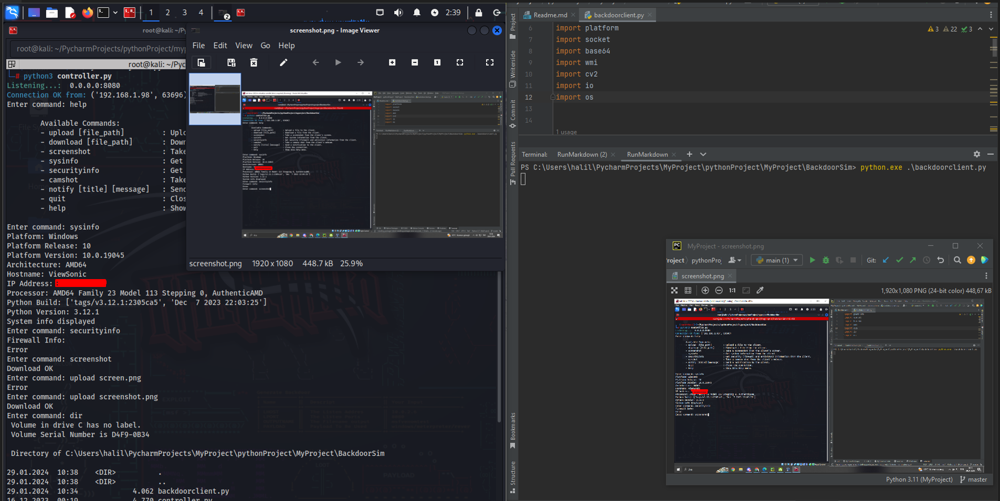

# **BackdoorSim**

</img>

## **Overview**
`BackdoorSim` is a remote administration and monitoring tool designed for educational and testing purposes. It consists of two main components: `ControlServer` and `BackdoorClient`. The server controls the client, allowing for various operations like file transfer, system monitoring, and more.

## **Disclaimer**
This tool is intended for educational purposes only. Misuse of this software can violate privacy and security policies. The developers are not responsible for any misuse or damage caused by this software. Always ensure you have permission to use this tool in your intended environment.


## **Features**
- **File Transfer**: Upload and download files between server and client.
- **Screenshot Capture**: Take screenshots from the client's system.
- **System Information Gathering**: Retrieve detailed system and security software information.
- **Camera Access**: Capture images from the client's webcam.
- **Notifications**: Send and display notifications on the client system.
- **Help Menu**: Easy access to command information and usage.

## **Installation**
To set up `BackdoorSim`, you will need to install it on both the server and client machines.

1. Clone the repository:

   ```shell
   $ git clone https://github.com/HalilDeniz/BackDoorSim.git
   ```

2. Navigate to the project directory:

   ```shell
   $ cd BackDoorSim
   ```

3. Install the required dependencies:

   ```shell
   $ pip install -r requirements.txt
   ```
## **Usage**
After starting both the server and client, you can use the following commands in the server's command prompt:

- `upload [file_path]`: Upload a file to the client.
- `download [file_path]`: Download a file from the client.
- `screenshot`: Capture a screenshot from the client.
- `sysinfo`: Get system information from the client.
- `securityinfo`: Get security software status from the client.
- `camshot`: Capture an image from the client's webcam.
- `notify [title] [message]`: Send a notification to the client.
- `help`: Display the help menu.


## **Disclaimer**
BackDoorSim is developed for educational purposes only. The creators of BackDoorSim are not responsible for any misuse of this tool. This tool should not be used in any unauthorized or illegal manner. Always ensure ethical and legal use of this tool.

## **DepNot: RansomwareSim**
If you are interested in tools like BackdoorSim, be sure to check out my recently released **[RansomwareSim](https://denizhalil.com/2023/12/30/ransomware-prevention-education/)** tool

## **Contributing**
Contributions, suggestions, and feedback are welcome. Please create an issue or pull request for any contributions.
1. Fork the repository.
2. Create a new branch for your feature or bug fix.
3. Make your changes and commit them.
4. Push your changes to your forked repository.
5. Open a pull request in the main repository.


## **Contact**
For any inquiries or further information, you can reach me through the following channels:

- LinkedIn : [Halil Ibrahim Deniz](https://www.linkedin.com/in/halil-ibrahim-deniz/)
- TryHackMe: [Halilovic](https://tryhackme.com/p/halilovic)
- Instagram: [deniz.halil333](https://www.instagram.com/deniz.halil333/)
- YouTube  : [Halil Deniz](https://www.youtube.com/c/HalilDeniz)
- Email    : halildeniz313@gmail.com

## 💰 You can help me by Donating
  Thank you for considering supporting me! Your support enables me to dedicate more time and effort to creating useful tools like BackDoorSim and developing new projects. By contributing, you're not only helping me improve existing tools but also inspiring new ideas and innovations. Your support plays a vital role in the growth of this project and future endeavors. Together, let's continue building and learning. Thank you!"<br>
  [](https://buymeacoffee.com/halildeniz) 
  [](https://patreon.com/denizhalil) 

  
## License
BackdoorSim is released under the [MIT License](LICENSE). See LICENSE for more information.
